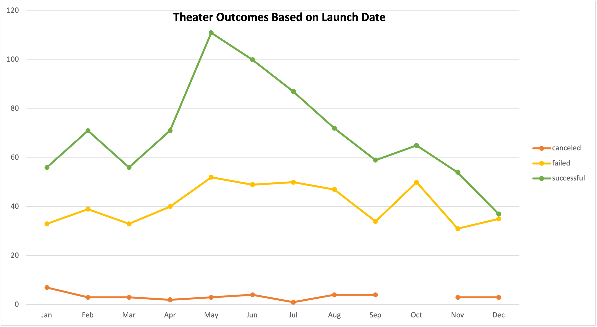

# kickstarter-analysis
University of Kansas Data Analytics Boot Camp: Performing analysis on Kickstarter data to uncover trends.

## Overview of Project
In this project the following was accomplished:
1. Imported data into Excel for analysis.
2. Filters, conditional formatting and formulas were used.
3. Pivot tables were generated and used for interpretation of data. 
4. Summary statistics were used and outliers in datasets were identified.
5. Excel analysis with visualizations were used and interpreted.

### Purpose
In Module 1: Kickstarting with Excel in the KU Data Analytics Boot Camp, Kickstarter analysis was initially conducted for a client to help her determine the perfect time to start a fundraising for a play, after failing to reach the amount for the fundraising goal she set, as such required a follow-up analysis.

It was realized that the for successful outcomes we must focus on launch dates and goal amounts as they are the main factors. For our analysis, the number of successful, failed and canceled outcomes are shown in relation with launch dates by month and the fundraising goal ranges

## Analysis and Challenges

### Analysis of Outcomes Based on Launch Date
The data was filtered by theater data as request by the client. Moreover, the live outcomes were filtered out of the data set. It can be seen from the graph below that the highest number of successful outcomes occurs around the months of May and June.

### Analysis of Outcomes Based on Goals

The live outcomes were filtered again at this stage. This time the client's is interested in the plays subcategory, therefore filters were used here as well. To focus on the goals they were categorized into groups of $5000; for each category the total number of successful, failed, and canceled outcomes were determined and converted into percentages to be used for the graph and analysis.

### Challenges and Difficulties Encountered

When calculating the canceled outcomes percentages they all had values of zero, which was confusing for me as a beginner in data analytics field this was checked and the formulas were accurate. To further check the raw data was filtered as well to make sure there were no canceled plays.

## Results

### What are two conclusions you can draw about the Outcomes based on Launch Date?
<ol>
  <li> Based on the graph, the highest number of successful theater outcomes occurs in the months of May and June, and keeps declining towards the end of the trend line. 
  <li> The number of canceled outcomes filtered by theater category is limited.
</ol>

### What can you conclude about the Outcomes based on Goals?
<ol>
  <li> Based on the graph, successful percentages of outcomes occur when the fundraising goals are less than $5000 goals or between $35000 and $50000 which can be further studied in later analysis.

### What are some limitations of this dataset?
There is no canceled plays examples in the subcategories which can be added to make the analysis more accurate and thorough.

### What are some other possible tables and/or graphs that we could create?
<ol>
  <li> We could create a line graph for the number of months between the lunch and deadline periods versus the number of outcomes and use couple of filters to focus on theater projects per the client's request. 
  <li> Examine the spotlight and staff pick for influence on the outcomes.
</ol>
